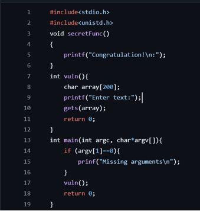

# LAB 1 
### BOF1.c
Dưới đây là code của `bof1.c`

Như ta thấy, ở đây có 1 lỗ hỏng để chúng ta khai thác đó chính là `gets(array)` không giới hạn dữ liệu người dùng nhập vào. Vì vậy kẻ tấn công có thể khai thác bằng cách nhập dữ liệu vào vượt quá số lượng đã khai báo.

**=> Dẫn đến buffer-overflow.**

Chúng ta sẽ sử dụng `gcc -g bof1.c -o bof1.out -fno-stack-protector -mpreferred-stack-boundary=2` để biên dịch chương trình.

Dựa vào code của bof1.c ta có thể vẽ được stackframe của bof1.c:

| Stackframe            |
|-----------------------|
|Array  (200 bytes)     |
|EBP  (4 bytes)         |
Return Address  (4 bytes)|
|Argc|
|Argv|

Ở đây nhiệm vụ của chúng ta là sẽ phải làm cho chương trình chạy hàm`secretFunc()` dù trong `main()` và `vuln()` không khai báo. Và dựa vào stackframe chúng ta đã phân tích được, chúng ta có thể dùng cách đó là lợi dụng hàm `gets(array)` để nhập sao cho vào số lượng dữ liệu vượt quá 200 bytes để xảy ra overflow và từ đó chúng ta có thể ghi đè lên được “return address” địa chỉ của hàm `secretFunc()` => `secretFunc()` có thể chạy được mà không cần khai báo.

Do đó, đầu tiên chúng ta sẽ đi lấy địa chỉ của hàm `secretFun()` bằng cách sử dụng gdb và câu lệnh `disas secretFunc`

**=> Chúng ta có được địa chỉ của `secretFunc()` là `0x0804846b`**

Sau đó chúng ta thực hiện lệnh `echo $(python -c "print('a'*204 +'\x6b\x84\x04\x08')") | ./bof1.out` để chạy chương trình mà không cần phải nhập vào do `echo` sẽ nhập vào giúp chúng ta. Ở đây ‘a’*204 là để gây ra overflow và ghi đè lên Array và EBP trên stackframe và tiếp đó là '\x6b\x84\x04\x08' dùng để ghi đè địa chỉ của `secretFunc()` lên Return Address.

### BOF2.c
Dưới đây là code của `bof2.c`

Lỗ hỏng để chúng ta khai thác ở đây đó chính là `buf` chỉ được khai báo có 40 bytes mà `fgets` đọc được đến 44 bytes => Chúng ta có thể sử dụng những bytes dư đó để gây ra overflow và thay đổi được giá trị của biến `check`.

Dựa vào code của bof2.c ta có thể vẽ được stackframe của bof2.c:
| Stackframe            |
|-----------------------|
|buf (40 bytes)|
|check (4 bytes)|
|var (4 bytes)|
|EBP|
|Return Address|
|Argc|
|Argv|

Tương tự, chúng ta sẽ sử dụng `gcc -g bof2.c -o bof2.out -fno-stack-protector -mpreferred-stack-boundary=2` để biên dịch chương trình.

Ở bài này, nhiệm vụ của chúng ta sẽ là thay đổi giá trị của biến `check` thành `0xdeadbeef`. Và như ở `bof1.c` chúng ta sẽ sử dụng overflow để ghi đè lên giá trị của `check` từ biến `buf`.

Dựa vào stackframe, ta biết được sau 40 bytes của `buf` sẽ đến 4 bytes của `check` do đó ta sẽ sử dụng lệnh `echo $(python -c "print('a'*40+'\xef\xbe\xad\xde')") | ./bof2.out` để có thể ghi đè giá trị `0xdeadbeef` cho biến `check`.

### BOF2.3
Dưới đây là code của `bof3.c`

Tương tự `bof2.c` lỗ hỏng để chúng ta có thể khai thác được ở đây là hàm `fgets()` đọc đến 133 bytes trong khi đó `buf` chỉ có 128 bytes => Chúng ta sẽ gây ra overflow để ghi đè lên địa chỉ mà con trỏ `*func` chỉ đến từ hàm `sup()` thành hàm `shell()`.

Từ code của `bof3.c` ta có stackframe:
| Stackframe            |
|-----------------------|
|buf (128 bytes)|
|*func (4 bytes)|
|var|
|EBP|
|Return Address|

Chúng ta sẽ dùng `gcc -g bof3.c -o bof3.out -fno-stack-protector -mpreferred-stack-boundary=2` để biên dịch chương trình.

Sau đó chúng ta sẽ dùng `gdb` và lệnh `disas shell` để xem địa chỉ của hàm `shell()`

Và chúng ta có được địa chỉ của `shell()` là `0x0804845b`

Sau đó chúng ta sẽ sử dụng lệnh `echo $(python -c "print('a'*128+'\x5b\x84\x04\x08')") | ./bof3.out` để ghi đè giá trị của `shell()` là `0x0804845b` lên địa chỉ chỉ đến của con trỏ `*func`.

Như thế là chúng ta đã thành công để hàm `shell` được chạy.